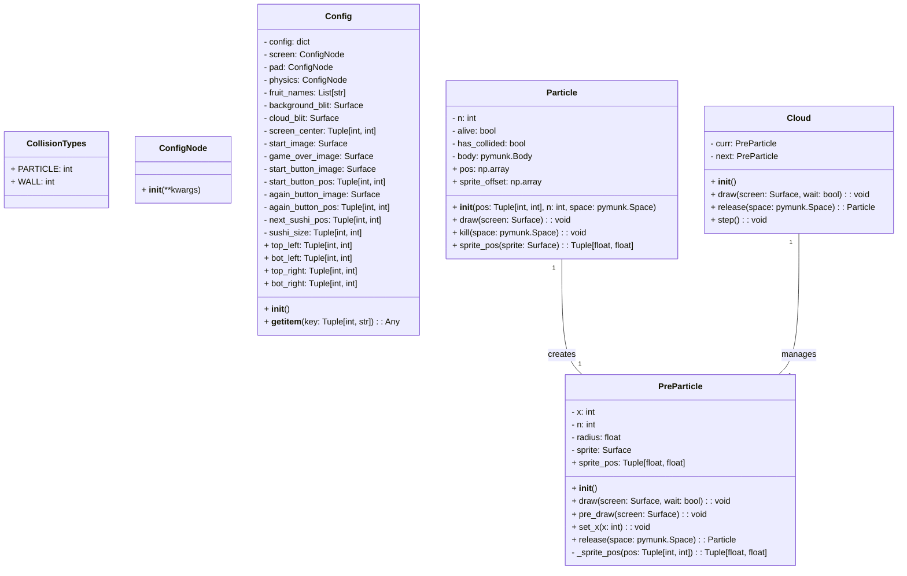

```mermaid
classDiagram
 class CollisionTypes {
        + PARTICLE: int
        + WALL: int
    }

    class ConfigNode {
        + __init__(**kwargs)
    }

    class Config {
        - config: dict
        - screen: ConfigNode
        - pad: ConfigNode
        - physics: ConfigNode
        - fruit_names: List[str]
        - background_blit: Surface
        - cloud_blit: Surface
        - screen_center: Tuple[int, int]
        - start_image: Surface
        - game_over_image: Surface
        - start_button_image: Surface
        - start_button_pos: Tuple[int, int]
        - again_button_image: Surface
        - again_button_pos: Tuple[int, int]
        - next_sushi_pos: Tuple[int, int]
        - sushi_size: Tuple[int, int]
        + __init__()
        + __getitem__(key: Tuple[int, str]): Any
        + top_left: Tuple[int, int]
        + bot_left: Tuple[int, int]
        + top_right: Tuple[int, int]
        + bot_right: Tuple[int, int]
    }

     class Particle {
        - n: int
        - alive: bool
        - has_collided: bool
        - body: pymunk.Body
        + __init__(pos: Tuple[int, int], n: int, space: pymunk.Space)
        + draw(screen: Surface): void
        + kill(space: pymunk.Space): void
        + pos: np.array
        + sprite_pos(sprite: Surface): Tuple[float, float]
        + sprite_offset: np.array
    }

    class PreParticle {
        - x: int
        - n: int
        - radius: float
        - sprite: Surface
        + __init__()
        + draw(screen: Surface, wait: bool): void
        + pre_draw(screen: Surface): void
        + sprite_pos: Tuple[float, float]
        + set_x(x: int): void
        + release(space: pymunk.Space): Particle
        - _sprite_pos(pos: Tuple[int, int]): Tuple[float, float]
    }
    class Cloud {
        - curr: PreParticle
        - next: PreParticle
        + __init__()
        + draw(screen: Surface, wait: bool): void
        + release(space: pymunk.Space): Particle
        + step(): void
    }


    Particle "1" -- "1" PreParticle : creates
    Cloud "1" -- "1" PreParticle : manages
```
